<!-- Banner principal -->
<p align="center">
  
</p>

<h1 align="center">🚀 Liberando Productos "Práctica Final"</h1>
<h3 align="center">CI/CD con FastAPI · Kubernetes · Prometheus · Alertmanager · Grafana</h3>

<p align="center">
  <a href="https://www.python.org/"></a>
  <a href="https://fastapi.tiangolo.com/"></a>
  <a href="https://www.docker.com/"></a>
  <a href="https://kubernetes.io/"></a>
  <a href="https://prometheus.io/"></a>
  <a href="https://grafana.com/"></a>
  <a href="https://github.com/features/actions"></a>
</p>

---

## 🧭 Descripción General

🚀 **Práctica Final - Liberando Productos (Solución)**  
Este repositorio contiene la solución a la práctica final del módulo **“Liberando Productos”**.  
El proyecto original (un servidor FastAPI) ha sido mejorado para incluir un pipeline completo de **CI/CD**, **despliegue en Kubernetes**, **monitoreo con Prometheus**, **alertas con Alertmanager** y **visualización con Grafana**.

Este documento sirve como una guía completa para que cualquier usuario pueda configurar su entorno y reproducir la solución desde cero.

📌Nota sobre el Proyecto Base: Este trabajo se construye a partir de un proyecto inicial proporcionado por KeepCoding. Para fines de referencia y auditoría.

---

## 📚 Tabla de Contenidos

- [🧭 Descripción General](#-descripción-general)
- [🏗️ Arquitectura de la Solución](#️-arquitectura-de-la-solución)
- [🧩 Guía de Reproducción y Entregables](#-guía-de-reproducción-y-entregables)
  - [⚙️ Pre-requisitos y Configuración del Entorno](#️-pre-requisitos-y-configuración-del-entorno)
  - [Opción A: Entorno Windows (WSL 2) - Recomendado](#opción-a-entorno-windows-wsl-2---recomendado)
  - [Opción B: Entorno Ubuntu Nativo (o VM)](#opción-b-entorno-ubuntu-nativo-o-vm)
  - [🔧 Instalación de herramientas CLI comunes (Minikube, kubectl, Helm, GitHub CLI)](#-instalación-de-herramientas-cli-comunes-minikube-kubectl-helm-github-cli)
- [📦 Clonar y preparar el proyecto](#-clonar-y-preparar-el-proyecto)
- [🧠 Modificaciones de la Aplicación](#-modificaciones-de-la-aplicación)
- [🧪 Pipeline de CI/CD (GitHub Actions)](#-pipeline-de-cicd-github-actions)
- [☸️ Despliegue en Kubernetes](#️-despliegue-en-kubernetes)
- [🔬 Verificación del Monitoreo (Prometheus)](#-verificación-del-monitoreo-prometheus)
- [🔔 Configuración de Alertas (Prometheus + Slack)](#-configuración-de-alertas-prometheus--slack)
- [📷 Galería de Resultados](#-galería-de-resultados)
- [🧾 Créditos](#-créditos)
---

## 🏗️ Arquitectura de la Solución

El flujo de trabajo implementado es el siguiente:

- **CI (GitHub Actions):** En cada push a `main`, se ejecutan tests unitarios (`pytest`).
- **CD (GitHub Actions):** Si los tests pasan, se construye la imagen Docker y se publica en GitHub Container Registry (GHCR).
- **Despliegue (Kubernetes):** Se usa un clúster local de Minikube para desplegar la aplicación con los manifiestos en `k8s/`.
- **Monitoreo (Prometheus):** Se instala la stack `kube-prometheus-stack` (vía `helm`), que descubre y “raspa” automáticamente las métricas expuestas.
- **Alertas (Alertmanager):** Una regla personalizada vigila el uso de CPU. Si supera el 80% del límite, Alertmanager envía una alerta CRITICAL a Slack.
- **Visualización (Grafana):** Un dashboard personalizado (`grafana/dashboard.json`) muestra métricas en tiempo real.

## 🧩 Guía de Reproducción y Entregables

A continuación se detallan los pasos para reproducir la solución completa.

### ⚙️ Pre-requisitos y Configuración del Entorno

Esta guía ofrece dos caminos para la configuración de Docker. Los pasos 1.3, 1.4, 1.5 y 1.6 son comunes para ambos entornos.

---

### Opción A: Entorno Windows (WSL 2) - Recomendado

####  Instalar WSL 2 y Ubuntu

Abre una terminal de PowerShell o CMD como Administrador:

```powershell
wsl --install
```
⚠️ Reinicia tu PC. Luego abre "Ubuntu" desde el menú de inicio y completa la configuración inicial.

#### Instalar Docker Desktop

Descarga desde docker.com y asegúrate de activar:
- ✅ "Use WSL 2 instead of Hyper-V"
- ✅ Settings > Resources > WSL Integration > Activar para "Ubuntu"


### Opción B: Entorno Ubuntu Nativo (o VM)

#### Instalar Docker Engine

```Bash
sudo apt update
sudo apt install curl -y
sudo apt install docker.io -y
sudo usermod -aG docker $USER && newgrp docker
```
⚠️ Cierra sesión y vuelve a iniciar para aplicar el cambio de grupo

### 🔧 Instalación de herramientas CLI comunes (Minikube, kubectl, Helm, GitHub CLI)


####  Instalar Herramientas CLI (Común para ambos entornos)

Abre tu terminal de Ubuntu (ya sea WSL o Nativo) para instalar las siguientes herramientas:

#### A. Instalar Minikube (Nuestro Clúster de Kubernetes)

```bash
curl -Lo minikube https://storage.googleapis.com/minikube/releases/latest/minikube-linux-amd64
sudo install minikube /usr/local/bin/
rm minikube
```

#### B. Instalar kubectl (Para hablar con Kubernetes)

```Bash
sudo snap install kubectl --classic
 ```

 #### C. Instalar Helm (Para desplegar Prometheus)

 ```Bash
sudo snap install helm --classic
 ```

#### D. Instalar GitHub CLI (Para autenticación)

```Bash
# Instalar gpg
sudo apt update
sudo apt install gpg

# Descargar, de-armorear y dar permisos a la llave GPG
curl -fsSL https://cli.github.com/packages/githubcli-archive-keyring.gpg | sudo gpg --dearmor -o /usr/share/keyrings/githubcli-archive-keyring.gpg
sudo chmod go+r /usr/share/keyrings/githubcli-archive-keyring.gpg

# Añadir el repositorio de GitHub CLI a apt
echo "deb [arch=$(dpkg --print-architecture) signed-by=/usr/share/keyrings/githubcli-archive-keyring.gpg] https://cli.github.com/packages stable main" | sudo tee /etc/apt/sources.list.d/github-cli.list > /dev/null

# Actualizar e instalar
sudo apt update
sudo apt install gh -y

```

#### Autenticación CLI de GitHub (gh)

Esto es necesario para que `gh` pueda autenticarte y tengas permisos de workflow

```Bash
gh auth login
```
What account do you want to log into? -> **GitHub.com** (Presiona Enter)

What is your preferred protocol for Git operations on this host? -> (Usa las flechas) Selecciona **HTTPS** (Presiona Enter)

Authenticate Git with your GitHub credentials? -> **Y** (Presiona Enter)

How would you like to authenticate GitHub CLI? -> **Login with a web browser** (Presiona Enter)

Copia el código de un solo uso (ej. XXXX-XXXX).

Presiona Enter para abrir el navegador.

Ve a la direccion: `https://github.com/login/device`

Pega el `código` en el navegador y haz clic en **Continue**.

¡PÁGINA DE PERMISOS CRUCIAL! Haz clic en **"Authorize GitHub"**. En la siguiente página, **DEBES** autorizar los permisos (scopes) **workflow** y **write:packages**.

Una vez `autorizado`, vuelve a la terminal. Debería decir ✓ Authentication complete.

####  Autenticación del Motor de Docker (docker login)

Esto es necesario para que `kubectl` pueda descargar la imagen desde GHCR.
A. Generar un `PAT` en `GitHub`
- Ve a GitHub > Settings > Developer settings > Personal access tokens > Tokens (classic)
- Haz clic en "Generate new token" (classic)
- Marca el scope read:packages
- Copia el token generado (ej. ghp_...)

B. Iniciar sesión en Docker
```Bash
docker login ghcr.io
```
- Username: tu usuario de GitHub
- Password: pega el PAT generado
✅ Verás Login Succeeded! y se creará ~/.docker/config.json.

#### Instalar Python y Venv (Común para ambos entornos)

```Bash
sudo apt update
sudo apt install python3 python3-pip python3-venv
```

📌 Nota: El paquete python3-venv es obligatorio para que python3 -m venv venv funcione correctamente.

### 📦 Clonar y preparar el proyecto

####  Clona este repositorio

```Bash
git clone https://github.com/naesman1/LP-practica-final.git
cd LP-practica-final
```

####  Probar localmente

```Bash
python3 -m venv venv
source venv/bin/activate
pip install -r requirements.txt
pytest
```

### 🧠 Modificaciones de la Aplicación

El código fuente original fue modificado para cumplir los nuevos requisitos:

Nuevo endpoint `/bye`: Añadido en s`rc/application/app.py`.

Nueva métrica: Contador de `Prometheus` `bye_requests_total`.

Nuevo test unitario: En `src/tests/app_test.py` para validar el nuevo endpoint.

### 🧪 Pipeline de CI/CD (GitHub Actions)

El archivo ./github/workflows/ci-cd.yml define el pipeline:

Job `test`: Instala Python 3.11, dependencias y ejecuta `pytest --cov`.

Job `build-and-push`: Inicia sesión en `GHCR`, construye la imagen `Docker` y la sube al registro.

📌Nota: Para usar el pipeline en tu fork, habilita los permisos de escritura para `Github Actions` en tu repositorio.

### ☸️ Despliegue en Kubernetes

Sigue los pasos para desplegar toda la infraestructura en Minikube.

#### 🪄  Iniciar Minikube

```Bash
minikube start --driver=docker
```

Al especificar `--driver=docker`, le estás dando la instrucción explícita de no crear una máquina virtual completa. En su lugar, le pides que ejecute el nodo de `Kubernetes` directamente dentro de un `contenedor Docker` en tu sistema.

#### 🪄 Instalar la Stack de Monitoreo

```Bash
helm repo add prometheus-community https://prometheus-community.github.io/helm-charts
helm repo update
helm install prometheus prometheus-community/kube-prometheus-stack --namespace monitoring --create-namespace
```

⏱️ Espera 2–3 minutos a que todos los pods en `monitoring` estén en estado Running.

```Bash
kubectl get pods --namespace monitoring
```


#### 🪄 Crear Secreto de GHCR

Ahora que `docker login` (Paso 1.5) creó el `config.json`, este comando funcionará:

```Bash
kubectl create secret generic ghcr-creds --from-file=.dockerconfigjson=${HOME}/.docker/config.json --type=kubernetes.io/dockerconfigjson
```

#### 🪄 Desplegar la Aplicación y Reglas

```Bash
kubectl apply -f k8s/
```

Esto creará todos los manifiestos en la carpeta `k8s/`: el `Deployment`, `Service`, `ServiceMonitor` y, crucialmente, la `PrometheusRule`.

### 🔬 Verificación del Monitoreo (Prometheus)

Antes de probar las alertas, verifica que Prometheus esté viendo tu aplicación.

#### 🪄 Acceder a la UI de Prometheus

En una terminal nueva, inicia un `port-forward`:

```Bash
kubectl --namespace monitoring port-forward svc/prometheus-kube-prometheus-prometheus 9090:9090
```

Abre en tu navegador: `http://localhost:9090`

#### 🪄 Paso 6.2: Verificar "Targets"

En la **UI** de **Prometheus**, ve a **Status** -> **Targets health**.

Busca el endpoint `serviceMonitor/default/simple-server-servicemonitor/0`.

El estado `(State)` debe ser **UP** (en verde). 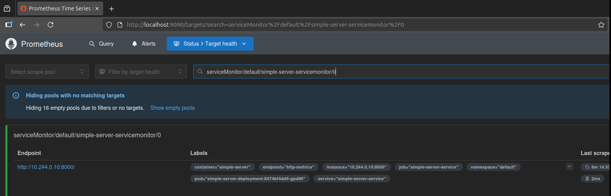

#### 🪄  Verificar "Alerts"

En la **UI** de **Prometheus**, ve a la pestaña **Alerts**.

Deberías ver tu alerta `HighCpuUsage` listada.

Su estado inicial debe ser **INACTIVE** (en verde). 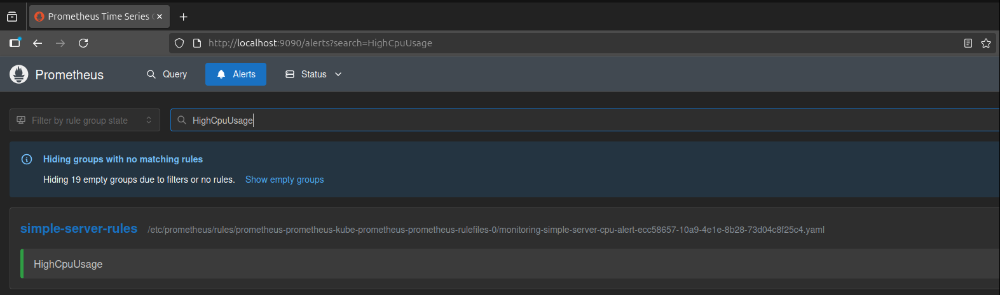

### 🔔 Configuración de Alertas (Prometheus + Slack)

#### 🪄 Paso Crear Canal y Webhook de Slack

##### A. Crear un Workspace de Slack (si no tienes uno):

Ve a https://slack.com/create para crear un nuevo workspace (espacio de trabajo) gratuito.

Sigue los pasos de registro (email, nombre del workspace, etc.).

##### B. Crear un Canal en Slack:

Una vez dentro de tu workspace de Slack (ya sea nuevo o existente).

En la barra lateral, haz clic en el **+** al lado de `"Canales"` y selecciona `"Crear un nuevo canal"`.

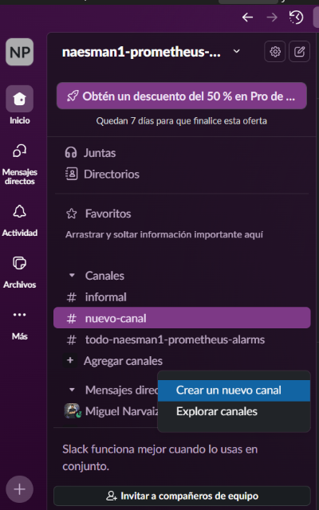

Dale un `nombre` (ej. naesman-prometheus-alarms).

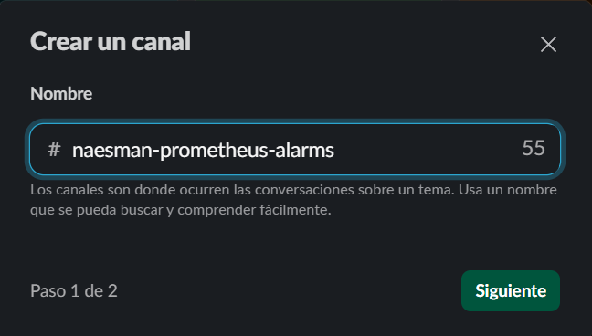

Hazlo `público` o `privado` y haz clic en **"Crear"**.

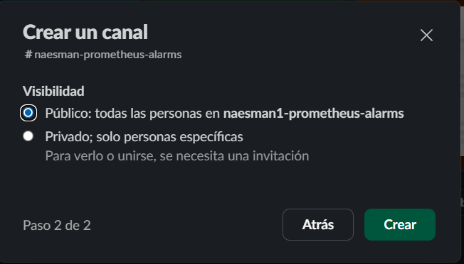

##### C. Generar el Webhook Entrante:

En tu navegador, ve a la página de la aplicación `"Incoming WebHooks"`: `https://app.slack.com/apps/A0F7XDUAZ-incoming-webhooks`.

Haz clic en el botón verde **"Agregar a Slack"**.

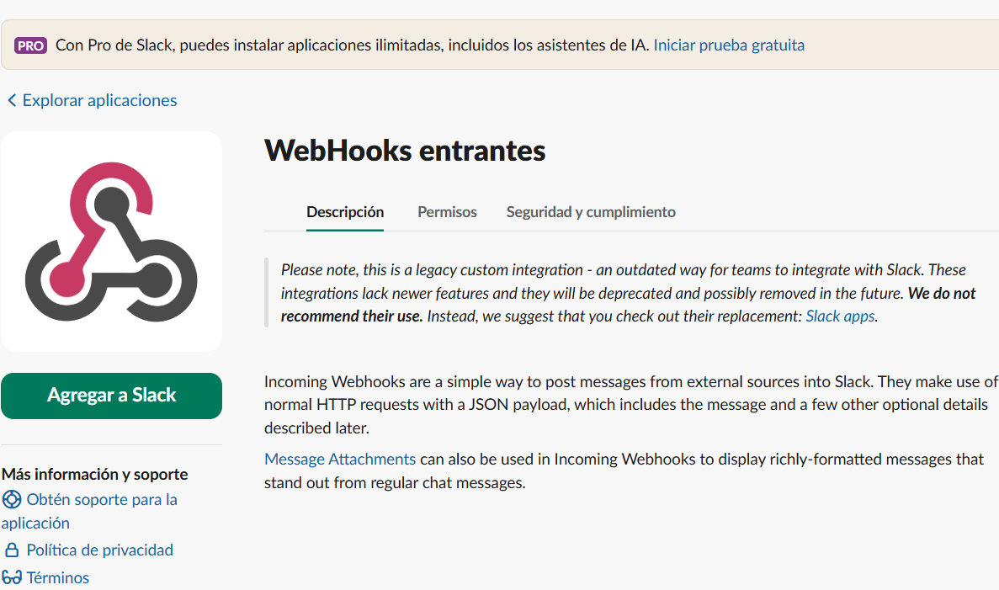

En la página siguiente, verificar que estás en tu `Workspace` en la equina superior derecha.
En la  `"Selecciona canal..."`, selecciona el canal que acabas de crear (ej. #naesman-prometheus-alarms).

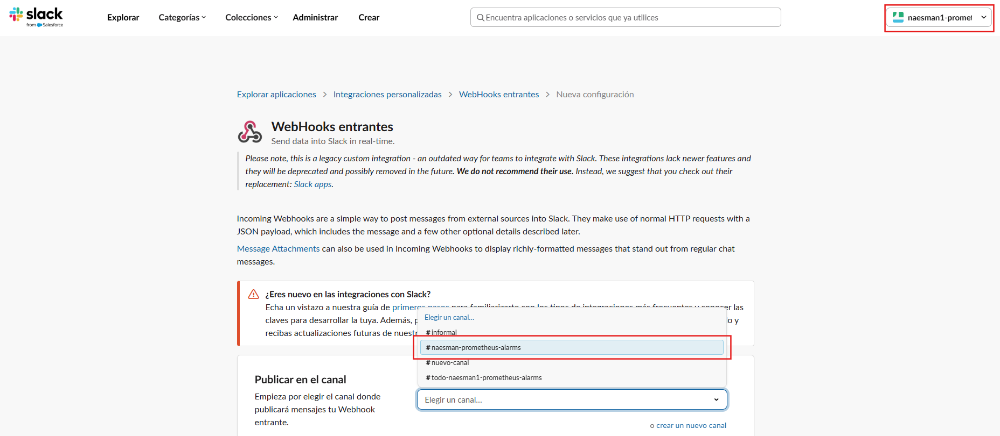

Haz clic en el botón **"Add Incoming WebHooks integration"**.

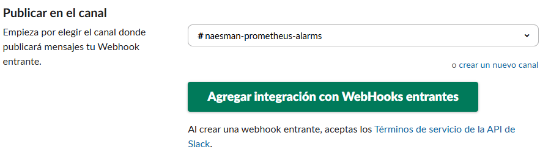

¡Listo! En la siguiente página, COPIA la `"Webhook URL"` **(es un secreto, empieza con `https://hooks.slack.com/`...)**.

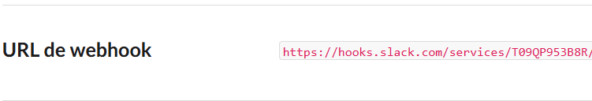

#### 🪄 Configurar Alertmanager

Abre el archivo `alertmanager.yaml` de este repositorio.

**PEGA** tu `"Webhook URL"` secreta en los dos campos que dicen **`slack_api_url: '...TU_URL_AQUI...'`**.

CAMBIA el `channel`: al nombre exacto de tu canal de Slack (ej. `#naesman-prometheus-alarms`).

Aplica la configuración al clúster:

```Bash
kubectl --namespace monitoring create secret generic alertmanager-prometheus-kube-prometheus-alertmanager --from-file=alertmanager.yaml=alertmanager.yaml --dry-run=client -o yaml | kubectl apply -f -
```

Reinicia Alertmanager para que cargue la nueva configuración:

```Bash
kubectl --namespace monitoring rollout restart statefulset/alertmanager-prometheus-kube-prometheus-alertmanager
```
#### 🧪 Probar la Alerta de CPU (Prueba de Estrés)

Lanza un pod `"atacante"` para generar carga (pueden ser 3 terminales nuevas por separado):

```Bash

#En una nueva terminal 

kubectl run stress-tester --image=busybox:1.28 --rm -it -- /bin/sh
```

Una vez dentro del `pod`, pega este script para golpear un endpoint, Se pueden crear 3 pods y correr por separado los comandos para golpear todos los endpoints al mismo tiempo:

1. Atacar SOLO el endpoint / (main)

Este script generará tráfico únicamente para el endpoint principal.

```Bash
# Lanzar 10 procesos en background
for i in $(seq 1 10); do
  while true; do wget -q -O- http://simple-server-service:8081/; done 
done
```

2. Atacar SOLO el endpoint /health

Este script generará tráfico únicamente para el endpoint de "health check".

```Bash
# Lanzar 10 procesos en background
for i in $(seq 1 10); do
  while true; do wget -q -O- http://simple-server-service:8081/health; done 
done
```

3. Atacar SOLO el endpoint /bye

Este es el script que está en el README.md, útil para probar la alerta de CPU.

```Bash
# Lanzar 10 procesos en background
for i in $(seq 1 10); do
  while true; do wget -q -O- http://simple-server-service:8081/bye; done
done 
```

🔥 Observa:

En la UI de Prometheus (Alerts), la alerta `HighCpuUsage` pasará a **PENDING** (amarillo) 

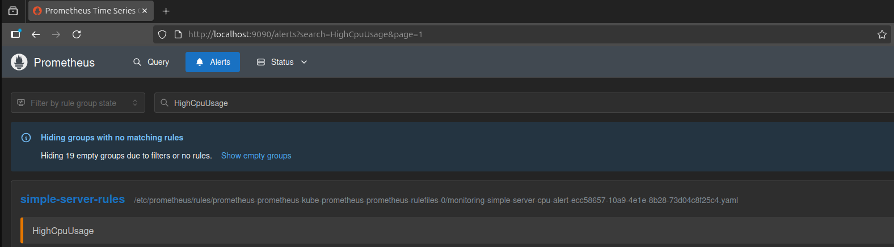

Y luego a **FIRING** (rojo) después de unos minutos.


Recibirás una notificación **CRITICAL** en tu canal de Slack. 

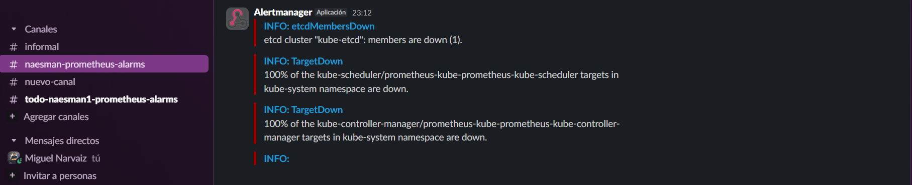

Corta el proceso de estress con `(Ctrl+C)` o elimina el pod.

###  📊 Dashboard de Grafana

El dashboard final se encuentra en `grafana/dashboard.json`.

#### 🪄 Acceder a Grafana

Obtener la contraseña de grafana y **COPIAR** para usarla en la UI.

```Bash
# Obtener contraseña de admin
kubectl --namespace monitoring get secrets prometheus-grafana -o jsonpath="{.data.admin-password}" | base64 -d ; echo

# Iniciar port-forward (en una terminal separada)
kubectl --namespace monitoring port-forward $(kubectl --namespace monitoring get pod -l "app.kubernetes.io/name=grafana,app.kubernetes.io/instance=prometheus" -oname) 3000:3000
```

Accede en el navegador: 👉 `http://localhost:3000` (Usuario: admin, Contraseña: la obtenida arriba)

#### 🪄 Importar el Dashboard

En Grafana:

Ir **Connections** -> **Add New Connection** -> Seleccionar **Prometheus** 

```Bash
#Poner nombre en este ejemplo: prometheus-1

#En Connection, prometheus server URL:
 
http://prometheus-kube-prometheus-prometheus.monitoring.svc:9090

```


Dar clic en **Save & test** y verás el mensaje de `Successfully queried the Prometheus API.`

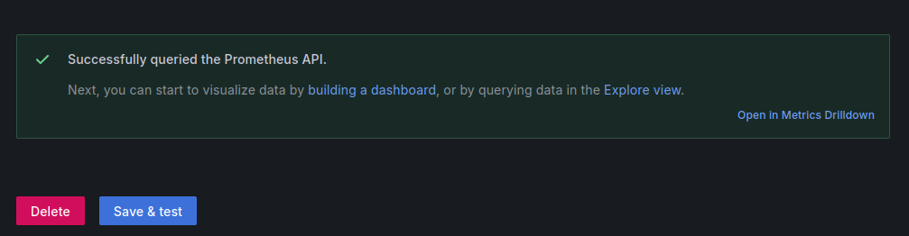

Ve a Dashboards → **New** → **Import**.

Sube o pega el contenido del archivo `grafana/dashboard.json`.

Clic en el boton `Edit` -> seleccionar la vista `Llamadas a Endpoints por Segundos` y oprimir el botón `e`

En la parte de `Absolute time range` seleccionar `Time zone` `UTC` y luego `Apply time range`

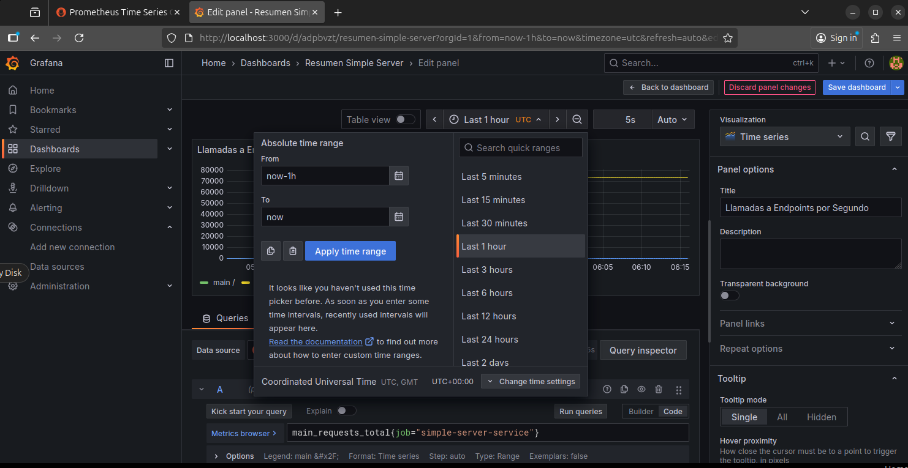

Y en Data Source `prometheus-1` y luego `Save dashboard`

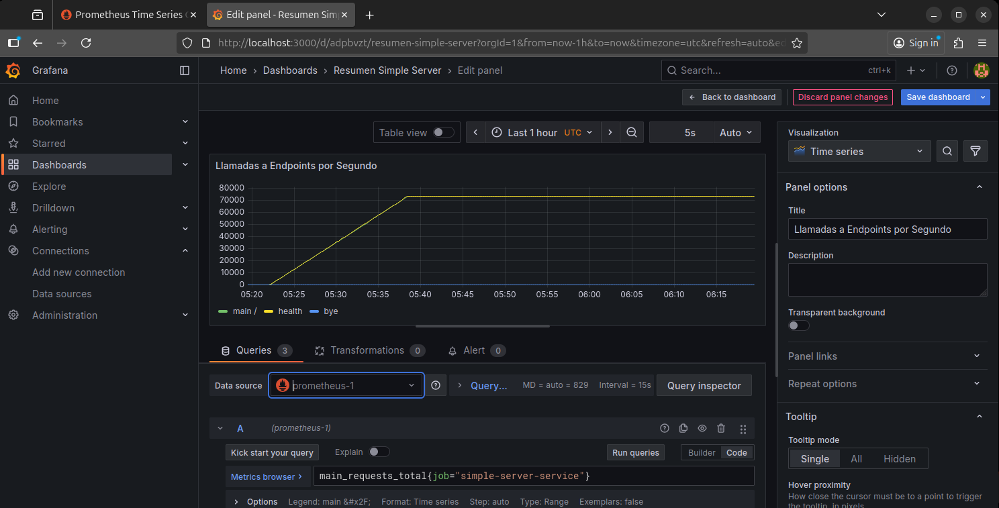

Y podrás observar los datos en la gráfica 

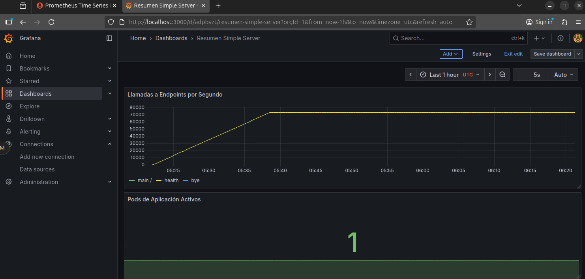


## 📷 Galería de Resultados


🧪 Pipeline de Pruebas

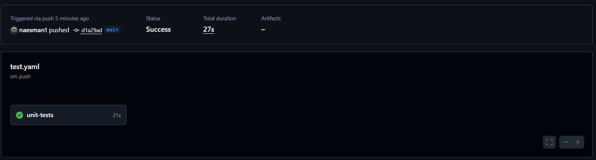

🚀 Pipeline de Despliegue

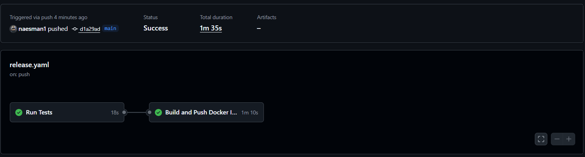

📦 Paquete en GHCR

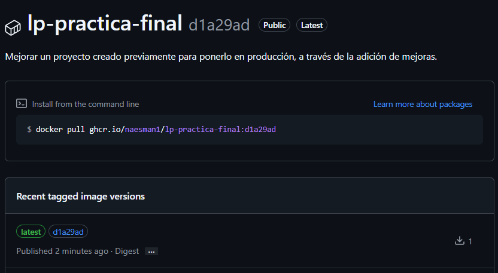

🎯 Prometheus Target UP


🔥 Alerta FIRING en Prometheus


🔔 Alerta CRITICAL en Slack


📈 Dashboard de Grafana


## 🧾 Créditos

Desarrollado por Miguel Ángel Narvaiz Eslava - naesman1
📘 Módulo: Liberando Productos – KeepCoding DevOps Bootcamp
🧑‍💻 Tecnologías: FastAPI · Docker · GitHub Actions · Kubernetes · Prometheus · Alertmanager · Grafana


 


