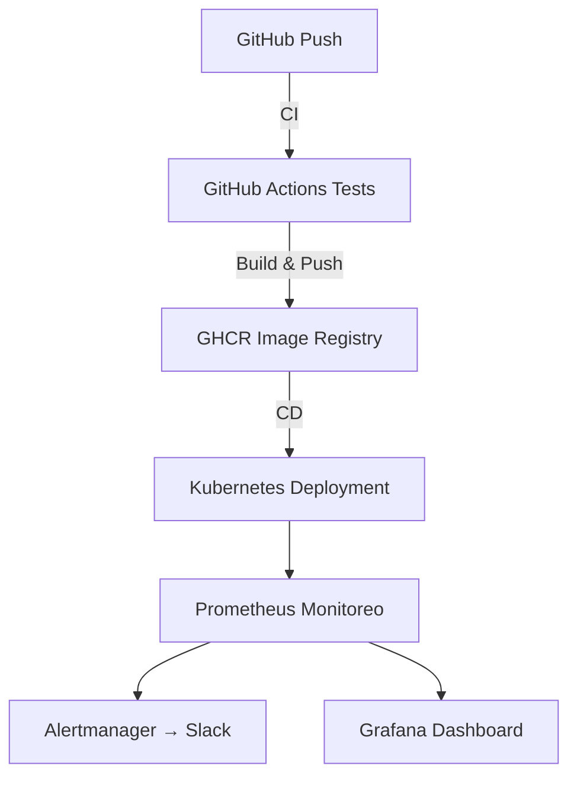

<!-- Banner principal -->
<p align="center">
  
</p>

<h1 align="center">🚀 Liberando Productos "Práctica Final"</h1>
<h3 align="center">CI/CD con FastAPI · Kubernetes · Prometheus · Alertmanager · Grafana</h3>

<p align="center">
  <a href="https://www.python.org/"></a>
  <a href="https://fastapi.tiangolo.com/"></a>
  <a href="https://www.docker.com/"></a>
  <a href="https://kubernetes.io/"></a>
  <a href="https://prometheus.io/"></a>
  <a href="https://grafana.com/"></a>
  <a href="https://github.com/features/actions"></a>
</p>

---

## 🧭 Objetivo

El objetivo de esta práctica es mejorar un proyecto existente para ponerlo en **producción**, incorporando un pipeline de **CI/CD**, despliegue en **Kubernetes**, monitoreo con **Prometheus**, alertas en **Slack** mediante **Alertmanager**, y visualización de métricas en **Grafana**.

---

<details>
<summary>📚 <b>Índice</b></summary>

- [🏗️ Arquitectura de la Solución](#️-arquitectura-de-la-solución)
- [🧩 Guía de Reproducción y Entregables](#-guía-de-reproducción-y-entregables)
  - [⚙️ Pre-requisitos y Configuración del Entorno](#️-pre-requisitos-y-configuración-del-entorno)
  - [📥 Clonar y Preparar el Proyecto](#-clonar-y-preparar-el-proyecto)
  - [🧠 Modificaciones de la Aplicación](#-modificaciones-de-la-aplicación)
  - [🧪 Pipeline de CI/CD (GitHub Actions)](#-pipeline-de-cicd-github-actions)
  - [☸️ Despliegue en Kubernetes](#️-despliegue-en-kubernetes)
  - [🔬 Verificación del Monitoreo (Prometheus)](#-verificación-del-monitoreo-prometheus)
  - [🔔 Configuración de Alertas (Prometheus  Slack)](#-configuración-de-alertas-prometheus--slack)
  - [📊 Dashboard de Grafana](#-dashboard-de-grafana)
  - [⚠️ Problema Común: Desfase de Hora](#️-problema-común-desfase-de-hora)
- [📷 Galería de Resultados](#-galería-de-resultados)
- [🧾 Créditos](#-créditos)

</details>

---

## 🏗️ Arquitectura de la Solución



**Flujo de trabajo completo:**
- 🧪 **CI (GitHub Actions)**: ejecuta pruebas y cobertura.
- 🐳 **CD (GitHub Actions)**: construye y publica la imagen Docker en GHCR.
- ☸️ **Despliegue (Kubernetes)**: despliegue en Minikube con manifiestos.
- 📈 **Monitoreo (Prometheus + Grafana)**: métricas y visualización.
- 🔔 **Alertas (Alertmanager + Slack)**: notificaciones críticas.

---

## 🧩 Guía de Reproducción y Entregables

### ⚙️ Pre-requisitos y Configuración del Entorno

#### 💻 Opción A: Windows (WSL 2)
```bash
# Instalar WSL 2 y Ubuntu
wsl --install
```

#### 🐧 Opción B: Ubuntu Nativo / VM
```bash
# Instalar Docker Engine
sudo apt update
sudo apt install docker.io -y
sudo usermod -aG docker $USER
```

#### 🧰 Herramientas CLI comunes
```bash
# Minikube
curl -Lo minikube https://storage.googleapis.com/minikube/releases/latest/minikube-linux-amd64
sudo install minikube /usr/local/bin/

# kubectl y Helm
sudo snap install kubectl --classic
sudo snap install helm --classic
```

---

### 📥 Clonar y Preparar el Proyecto
```bash
git clone https://github.com/naesman1/LP-practica-final.git
cd LP-practica-final
python3 -m venv venv
source venv/bin/activate
pip install -r requirements.txt
pytest
```

---

### 🧠 Modificaciones de la Aplicación

🧩 Se añadió un **nuevo endpoint** `/bye` y sus **tests unitarios**, junto con una **nueva métrica Prometheus** `bye_requests_total`.

---

### 🧪 Pipeline de CI/CD (GitHub Actions)

📁 Archivo: `.github/workflows/ci-cd.yml`
- `test`: ejecuta `pytest --cov`
- `build-and-push`: construye y publica imagen Docker en GHCR  
  (`ghcr.io/naesman1/simple-server:latest`)

---

### ☸️ Despliegue en Kubernetes

```bash
# Iniciar clúster local
minikube start --driver=docker

# Instalar Prometheus Stack
helm repo add prometheus-community https://prometheus-community.github.io/helm-charts
helm repo update
helm install prometheus prometheus-community/kube-prometheus-stack --namespace monitoring --create-namespace
```

🪄 Crear secreto GHCR y desplegar la aplicación:
```bash
kubectl create secret generic ghcr-creds --from-file=.dockerconfigjson=${HOME}/.docker/config.json --type=kubernetes.io/dockerconfigjson

kubectl apply -f k8s/
```

---

### 🔬 Verificación del Monitoreo (Prometheus)

```bash
kubectl --namespace monitoring port-forward svc/prometheus-kube-prometheus-prometheus 9090:9090
```

Luego abrir 👉 [http://localhost:9090](http://localhost:9090)

---

### 🔔 Configuración de Alertas (Prometheus + Slack)

1. Crea un **Webhook de Slack**
2. Configura el `alertmanager.yaml` con tu URL
3. Aplica el secreto:
```bash
kubectl --namespace monitoring create secret generic alertmanager-prometheus-kube-prometheus-alertmanager --from-file=alertmanager.yaml=alertmanager.yaml --dry-run=client -o yaml | kubectl apply -f -
```

4. Reinicia Alertmanager:
```bash
kubectl --namespace monitoring rollout restart statefulset/alertmanager-prometheus-kube-prometheus-alertmanager
```

---

### 📊 Dashboard de Grafana

```bash
# Obtener contraseña
kubectl --namespace monitoring get secrets prometheus-grafana -o jsonpath="{.data.admin-password}" | base64 -d ; echo

# Port-forward
kubectl --namespace monitoring port-forward $(kubectl get pods -n monitoring -l "app.kubernetes.io/name=grafana" -o name) 3000:3000
```

Accede a 👉 [http://localhost:3000](http://localhost:3000)

---

### ⚠️ Problema Común: Desfase de Hora
📅 Si Grafana no muestra datos, ajusta el rango temporal manualmente (p. ej., "Last 2 days").

---

## 📷 Galería de Resultados

| 🧪 Pruebas CI/CD | 🚀 Despliegue | 📦 GHCR |
|:--:|:--:|:--:|
| *(imagen aquí)* | *(imagen aquí)* | *(imagen aquí)* |

| 🎯 Prometheus | 🔔 Alertas Slack | 📈 Dashboard Grafana |
|:--:|:--:|:--:|
| *(imagen aquí)* | *(imagen aquí)* | *(imagen aquí)* |

🎥 **Video de presentación:** 👉 *(agregar enlace YouTube)*

---

## 🧾 Créditos

**Desarrollado por:** Miguel Ángel Narvaiz Eslava  
📘 *Módulo:* Liberando Productos – KeepCoding DevOps Bootcamp  
🧑‍💻 *Tecnologías:* FastAPI · Docker · GitHub Actions · Kubernetes · Prometheus · Alertmanager · Grafana  
🌐 *GitHub:* [@naesman1](https://github.com/naesman1)

---

> _💡 Proyecto desarrollado como práctica final del módulo “Liberando Productos”, demostrando un flujo completo de CI/CD y observabilidad en entornos Kubernetes._
